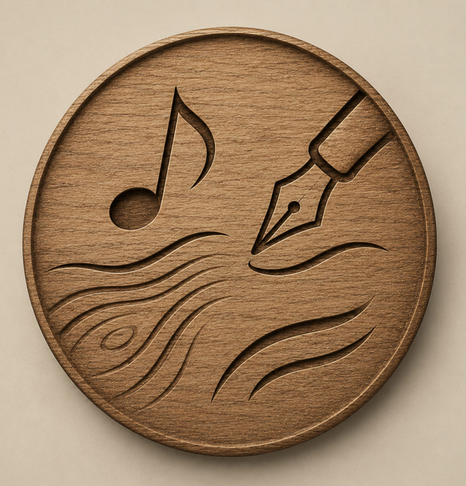

# Fustaventura

  

**Fustaventura** és un espai creatiu de Gobo26 per desenvolupar aventures, relats interactius, música, objectes de fusta, mapes, enigmes i petites experiències narratives.

La idea de fons és senzilla: una aventura feta amb mans de taller. Una mica de fusta, una mica d'escriptura, una mica de música, i camins que es van obrint a poc a poc.

## Primera direcció

- Aventures interactives en català.
- Històries amb objectes, pistes, mapes i decisions.
- Materials visuals amb textura artesanal.
- Música, veu i fragments narratius.
- Prototips petits abans de construir projectes grans.

## Estat

Espai acabat de preparar. De moment conté la identitat visual inicial i servirà com a base per ordenar futures peces de Fustaventura.

## Relació amb Gobo26

Fustaventura forma part de l'ecosistema Gobo26, però té prou personalitat per tenir casa pròpia.

Perfil Gobo26: https://github.com/Gobo26
